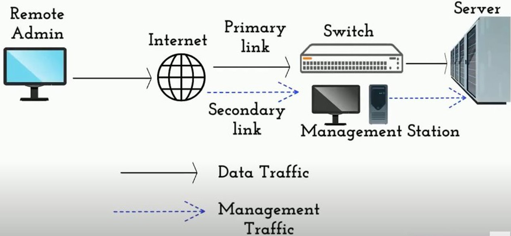
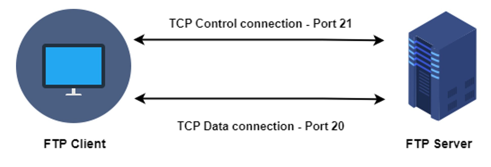
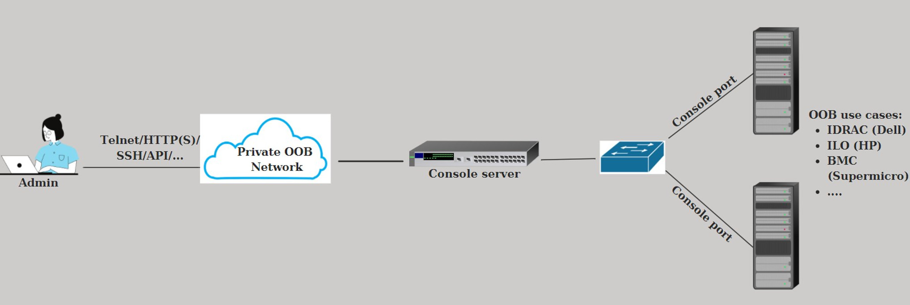
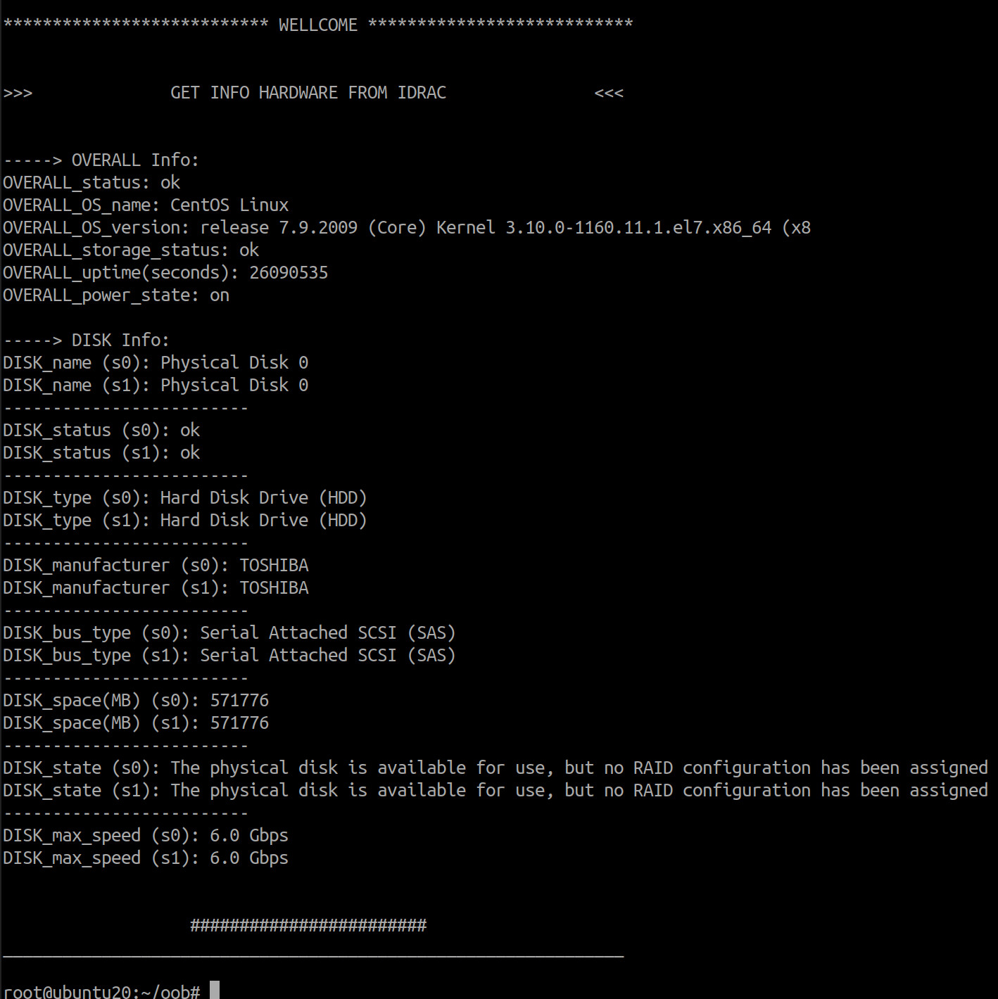

# OOB

In the systems management, mostly we know about the In-Band Management method but how about the Out-of-Band Management?

Let's find out.

# 1. What is OOB?
Out-Of-Band (OOB) Management (sometimes called lights-out management - LOM)  is a method of remotely controlling and managing **critical** IT assets and network equipment using a secure connection through a secondary interface that is physically separate from the primary network connection.

You know FTP protocol, right? It uses out-of-band control: the Control connection and the Data connection separation:

# 2. How does OOB works?

\- Independent of the production (main) network.

\- OOB use the management interfaces (or serial ports) for managing devices.

\- Protocols: Telnet, SSH, HTTP(S), SNMP, Redfish ....

\- Severs support: [Dell iDRAC](https://www.dell.com/support/kbdoc/en-us/000179517/dell-poweredge-how-to-configure-the-idrac-system-management-options-on-servers#idracmenu), [HPE ILO](https://www.hpe.com/us/en/servers/integrated-lights-out-ilo.html), [Supermicro BMC](https://www.supermicro.com/en/solutions/management-software/bmc-resources) ....

# 3. Why do we need OOB?

\- Allows remote reboot, shutdown, powering on the system.

\- Hardware sensor monitoring (fan speed, power voltages,...).

\- Can access local media like a DVD drive, or disk images, from the remote machine.

\- Can be used to adjust BIOS settings that may not be accessible after the operating system has already booted.

\- Settings for hardware RAID or RAM timings can also be adjusted as the management card needs no hard drives or main memory to operate.

Compare with In-Band Management

In-Band Management | Out-Of-Band Management
--- | --- |
Data and control commands travel across the same network route | Control data on a separate connection from main data
No additional manually configure the network settings | Manually configure the network settings
Only works after the operating system has been booted | Independent of the operation system
Low cost, independent of the vendors | High cost, dependent of the vendors

My Bash scripts using the SNMP protocol to get the server hardware information. Look into it to know more. Here is result:

